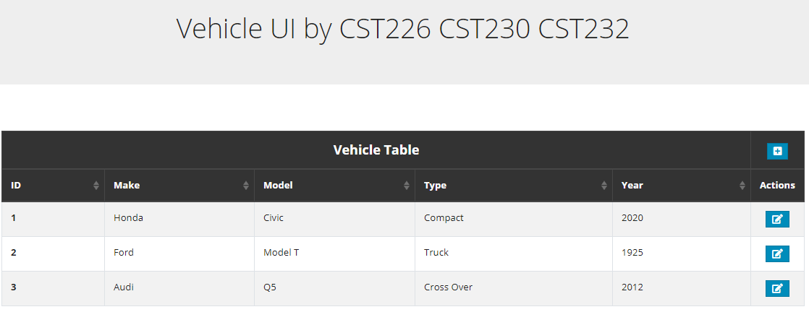
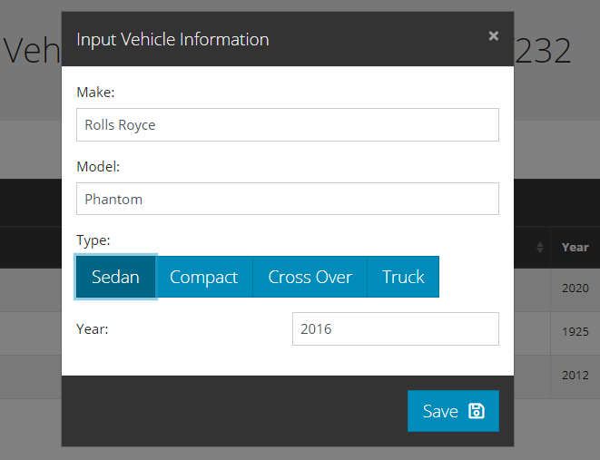
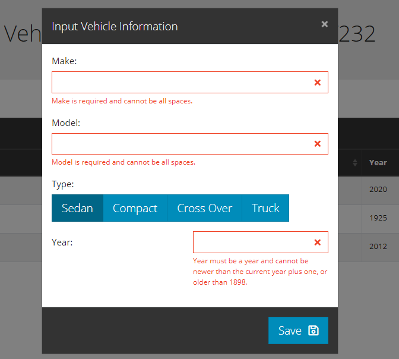

# vehicle-database-and-ui
This small project was created in second year Web Development class with two additional teammates.  It demonstrates a basic PHP web interface, built using Vue.js components, styled with Bootstrap-Vue.
The API allows GET, POST, and PUT HTTP request methods.
The back-end uses an Entity/Repository setup to populate an SQLite3 database.

# Screenshots

